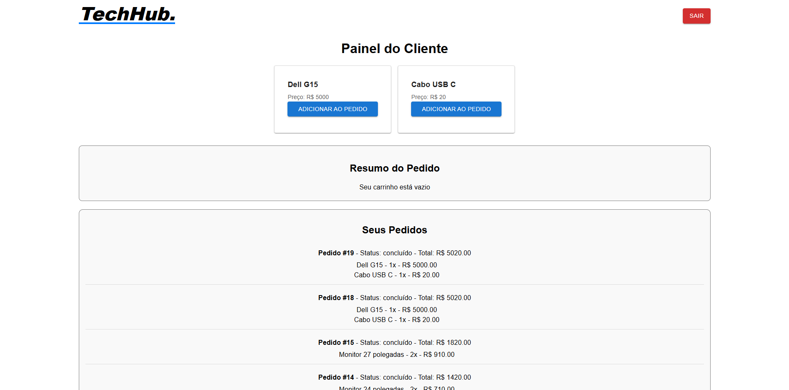

# 🛒 TechHub - E-commerce System  

TechHub is an e-commerce system built with **React (frontend)** and **Express (backend)**, allowing customers to place orders and suppliers to manage their products.  

## 🚀 Technologies Used  

- **Frontend:** React, Material-UI  
- **Backend:** Node.js, Express, Sequelize (SQLite)  
- **Authentication:** JWT (JSON Web Tokens)  
- **Database:** SQLite  

## 📌 Features  

### 🔹 **Customer Features:**  
- Browse available products  
- Add products to cart  
- Finalize orders  
- View order history  

### 🔹 **Supplier Features:**  
- Add new products  
- Update price and stock of products  
- Delete or deactivate products  
- View all products  

### Register Page:


### Login Page:


### Customer Page:


### Supplier Page:


### Supplier Edit Page:


## 🛠️ Installation and Setup  

### **1️⃣ Clone the Repository**  
```bash
git clone https://github.com/bernardoleris/techhub.git
cd techhub
```

### **2️⃣ Install Dependencies**  
Run the following commands in **both frontend and backend directories**:  
```bash
cd server
npm install

cd ../client/moz-todo-react
npm install
```

### **3️⃣ Configure Environment Variables**  
Create a `.env` file inside the **server** directory and add:  
```
PORT=5000
JWT_SECRET=your_secret_key
```

### **4️⃣ Run the Backend**  
```bash
cd server
npm start
```
or, if you have `nodemon` installed:  
```bash
nodemon src/index.js
```

### **5️⃣ Run the Frontend**  
```bash
cd client
npm start
```

Now, your **backend** will be running at `http://localhost:5000/`  
Your **frontend** will be available at `http://localhost:3000/`  

## 🔧 Troubleshooting  

- **If the backend doesn't start:** Make sure the `.env` file is correctly configured.  
- **If the frontend shows a blank page after login/logout:** Try refreshing manually or restarting the app.  
- **If the database doesn't update after changes:** Try running `npx sequelize db:migrate`.  

## 📌 Future Improvements  

- Add payment integration  
- Implement product reviews and ratings  
- Improve UI design and responsiveness  
